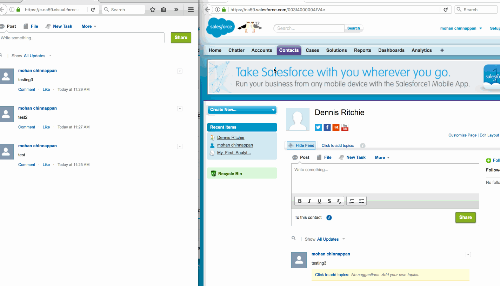

## Sample Marquee Console Footer Component


### Demo




------
### Code for the footer component

This component scrapes the top level items in a feed and scrolls them in a custom Console footer component.

Please note that this is sample code. It must be enhanced and tested to production quality as required if you choose to utilize it.

You can configure the refresh by changing  value of ```rate``` in ms.


```xml

<apex:page showHeader="false">

<style>
body {
    padding: 10px;
}
</style>

<style>
.classname {
    -moz-box-shadow:inset 0px 1px 0px 0px #bbdaf7;
    -webkit-box-shadow:inset 0px 1px 0px 0px #bbdaf7;
    box-shadow:inset 0px 1px 0px 0px #bbdaf7;
    background:-webkit-gradient( linear, left top, left bottom, color-stop(0.05, #79bbff), color-stop(1, #378de5) );
    background:-moz-linear-gradient( center top, #79bbff 5%, #378de5 100% );
    filter:progid:DXImageTransform.Microsoft.gradient(startColorstr='#79bbff', endColorstr='#378de5');
    background-color:#79bbff;
    -webkit-border-top-left-radius:10px;
    -moz-border-radius-topleft:10px;
    border-top-left-radius:10px;
    -webkit-border-top-right-radius:10px;
    -moz-border-radius-topright:10px;
    border-top-right-radius:10px;
    -webkit-border-bottom-right-radius:10px;
    -moz-border-radius-bottomright:10px;
    border-bottom-right-radius:10px;
    -webkit-border-bottom-left-radius:10px;
    -moz-border-radius-bottomleft:10px;
    border-bottom-left-radius:10px;
    text-indent:0;
    border:1px solid #84bbf3;
    display:inline-block;
    color:#ffffff;
    font-family:Arial;
    font-size:10px;
    font-weight:bold;
    font-style:normal;
    height:30px;
    line-height:30px;
    width:50px;
    text-decoration:none;
    text-align:center;
    text-shadow:1px 1px 0px #528ecc;
    margin-left:10px;
}
.classname:hover {
    background:-webkit-gradient( linear, left top, left bottom, color-stop(0.05, #378de5), color-stop(1, #79bbff) );
    background:-moz-linear-gradient( center top, #378de5 5%, #79bbff 100% );
    filter:progid:DXImageTransform.Microsoft.gradient(startColorstr='#378de5', endColorstr='#79bbff');
    background-color:#378de5;
}.classname:active {
    position:relative;
    top:1px;
}
</style>
<!--

    <div style="margin-left:auto; margin-right:auto;width:50%;">
    <input type="button" class="classname" onclick="scrollButtonText(); return false;" value="Start" />
    <input type="button" class="classname" onclick="setButtonText(); return false;" value="Stop" />
    </div>
  -->
  
    <apex:includeScript value="/support/console/40.0/integration.js"/>

    <script>
   
       function setButtonText() {
           sforce.console.setCustomConsoleComponentButtonText('Alerts');         
       }
       
       function blinkButtonText() {
            sforce.console.blinkCustomConsoleComponentButtonText('Hello World', 3000);
       }              
    
    
    
    </script>
    
   <!-- 003f4000004fV4e is the entity we care about for the feed -->    
  
   <chatter:feed entityId="003f4000004fV4e" rendered="true"/>
   
    <!-- <input type="button" onclick="blinkButtonText(); return false;" value="Blink Button Text" /> -->
     
    <script>
        function srcUp(url) {
            sforce.console.openPrimaryTab(null, url, true);
        }
       
        // refresh rate in ms 
        var rate = 10000;
        
        setInterval(function(){window.location.href = window.location.href;},rate);
         
        function getFeedItemBody() {
            var feeds = '';
            var elements = document.getElementsByClassName('feeditemtext');
            for (var i=0; i<elements.length; i++) {                
                feeds += elements[i].innerHTML + "         ";
            }
            return feeds;
        }        
        
        var feedItems = getFeedItemBody();

        scrollButtonText();       
                
        function scrollButtonText() {                   
            sforce.console.setCustomConsoleComponentButtonText(feedItems, function() {
                sforce.console.scrollCustomConsoleComponentButtonText(150, 5, true, function(result){});            
            });
         }
       
    </script>

</apex:page>


```
### Lightning version

Lightning Experience brings you real-time group feeds. No more page refreshes required to see what people are saying at the exact moment they say it. Each new post is briefly highlighted to call it to your attention. This feature is available in Lightning Experience only.

When new posts are added to a live feed, a message appears briefly at the top of the feed .


------

Comments Are Now Live!

Lightning Experience brings you real-time comments. No more page refreshes required to see what people are saying about a post at the exact moment they say it. Each new comment is briefly highlighted to call it to your attention. Comments refresh and stay live after you subscribe to them. Subscription is easy; just click in the comment field. This feature is available in Lightning Experience only.


### Step-by-step instructions about how to setup this component in Console

[Step-by-step instructions](./steps.md)


### References

1. [The "Marquee" Console Footer Component](https://developer.salesforce.com/page/The_%22Marquee%22_Console_Footer_Component)

2. [Group Feeds Are Now Live!](https://releasenotes.docs.salesforce.com/en-us/winter17/release-notes/rn_chatter_lex_live_feeds.htm)

3. [Get Started with Console Components](https://trailhead.salesforce.com/en/modules/service_components/units/service_components_comfortable)

4. [My Notes Console Footer Component](https://developer.salesforce.com/page/The_%22My_Notes%22_Console_Footer_Component)

5. [Customize a Console with Custom Components in Salesforce Classic](https://portal2dev-dreamevent.cs61.force.com/articleView?id=console2_components_overview.htm&type=5)

6. [chatter:feed](https://developer.salesforce.com/docs/atlas.en-us.pages.meta/pages/pages_compref_chatter_feed.htm)

7. [Comments Are Now Live!](https://releasenotes.docs.salesforce.com/en-us/winter17/release-notes/rn_chatter_lex_live_comments.htm)
