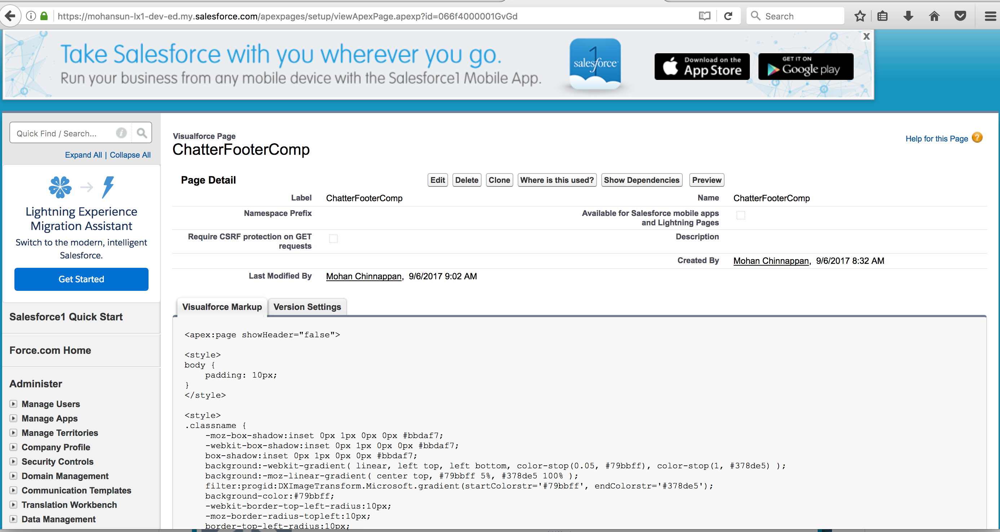

## Step-by-step instructions about how to setup a footer component in Classic Console

### Visualforce page named: ChatterFooterComp

1. Create Visualforce page named ChatterFooterComp with content as shown below:


```xml
<apex:page showHeader="false">

<style>
body {
    padding: 10px;
}
</style>

<style>
.classname {
    -moz-box-shadow:inset 0px 1px 0px 0px #bbdaf7;
    -webkit-box-shadow:inset 0px 1px 0px 0px #bbdaf7;
    box-shadow:inset 0px 1px 0px 0px #bbdaf7;
    background:-webkit-gradient( linear, left top, left bottom, color-stop(0.05, #79bbff), color-stop(1, #378de5) );
    background:-moz-linear-gradient( center top, #79bbff 5%, #378de5 100% );
    filter:progid:DXImageTransform.Microsoft.gradient(startColorstr='#79bbff', endColorstr='#378de5');
    background-color:#79bbff;
    -webkit-border-top-left-radius:10px;
    -moz-border-radius-topleft:10px;
    border-top-left-radius:10px;
    -webkit-border-top-right-radius:10px;
    -moz-border-radius-topright:10px;
    border-top-right-radius:10px;
    -webkit-border-bottom-right-radius:10px;
    -moz-border-radius-bottomright:10px;
    border-bottom-right-radius:10px;
    -webkit-border-bottom-left-radius:10px;
    -moz-border-radius-bottomleft:10px;
    border-bottom-left-radius:10px;
    text-indent:0;
    border:1px solid #84bbf3;
    display:inline-block;
    color:#ffffff;
    font-family:Arial;
    font-size:10px;
    font-weight:bold;
    font-style:normal;
    height:30px;
    line-height:30px;
    width:50px;
    text-decoration:none;
    text-align:center;
    text-shadow:1px 1px 0px #528ecc;
    margin-left:10px;
}
.classname:hover {
    background:-webkit-gradient( linear, left top, left bottom, color-stop(0.05, #378de5), color-stop(1, #79bbff) );
    background:-moz-linear-gradient( center top, #378de5 5%, #79bbff 100% );
    filter:progid:DXImageTransform.Microsoft.gradient(startColorstr='#378de5', endColorstr='#79bbff');
    background-color:#378de5;
}.classname:active {
    position:relative;
    top:1px;
}
</style>
<!--

    <div style="margin-left:auto; margin-right:auto;width:50%;">
    <input type="button" class="classname" onclick="scrollButtonText(); return false;" value="Start" />
    <input type="button" class="classname" onclick="setButtonText(); return false;" value="Stop" />
    </div>
  -->
  
    <apex:includeScript value="/support/console/40.0/integration.js"/>

    <script>
   
       function setButtonText() {
           sforce.console.setCustomConsoleComponentButtonText('Alerts');         
       }
       
       function blinkButtonText() {
            sforce.console.blinkCustomConsoleComponentButtonText('Hello World', 3000);
       }              
    
    
    
    </script>
    
   <!-- 0F9f4000000HlMc is the entity we care about for the feed -->    
  
   <chatter:feed entityId="0F9f4000000HlMc" rendered="true"/>
   
    <!-- <input type="button" onclick="blinkButtonText(); return false;" value="Blink Button Text" /> -->
     
    <script>
        function srcUp(url) {
            sforce.console.openPrimaryTab(null, url, true);
        }
       
        // refresh rate in ms 
        var rate = 10000;
        
        setInterval(function(){window.location.href = window.location.href;},rate);
         
        function getFeedItemBody() {
            var feeds = '';
            var elements = document.getElementsByClassName('feeditemtext');
            for (var i=0; i<elements.length; i++) {                
                feeds += elements[i].innerHTML + "         ";
            }
            return feeds;
        }        
        
        var feedItems = getFeedItemBody();

        scrollButtonText();       
                
        function scrollButtonText() {                   
            sforce.console.setCustomConsoleComponentButtonText(feedItems, function() {
                sforce.console.scrollCustomConsoleComponentButtonText(150, 5, true, function(result){});            
            });
         }
       
    </script>

</apex:page>
                                        

```




#### Demo-1


#### Demo-2

#### Creating a new chatter grop 


